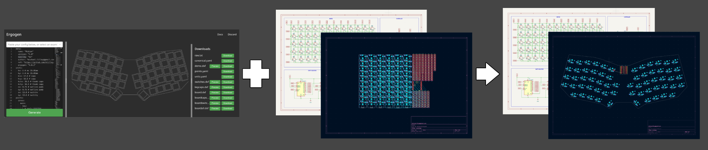

# Ergotool

Tools for working with ergogen-generated Kicad PCB files, including:

*`update`*: Layout parts in an existing schematic-driven kicad project, using positioning data from ergogen.





# Install

Requires <a href="https://go.dev/">Go</a> (download & install from here: <a href="https://go.dev/dl/">https://go.dev/dl/</a>).

Either clone the repo and build, or have go do it for you:

```
$ go install github.com/mlilley/go-ergotool/ergotool@latest
```

# Usage

*`update`*

Assuming you have both an Ergogen design outputting a standalone kicad_pcb file (with your parts positioned nicely), and a seaparate, typical schematic-driven kicad project, dump your footprints from schematic to pcb, then use the tool to take the positioning data from the ergogen file and apply it to your project pcb file.

```
$ ergotool update \
    --source /path/to/ergogen/output.kicad_pcb 
    --destination /path/to/kicad/project.kicad_pcb
```

Footprints are matched by "reference", so you do need to ensure both ergogen and your project use matching values.

Re-run again at anytime to reposition your parts, if you change your ergogen layout.

_Tested with Kicad8 and ergogen 4._


